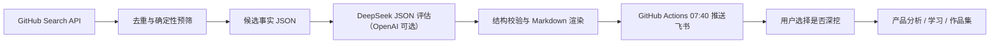

# AI GitHub Radar

每天发现并评估少量与 **Agent、Agent Skill、Agent 工作流** 有关的 GitHub 项目，在北京时间 07:40 发送到飞书。目标不是制造更多收藏，而是帮助读者判断项目的当下/未来价值，并将少数项目转化为产品分析、学习成果和作品集。

## 混合云流程



项目刻意将“事实计算”和“模型判断”分开：`radar.py` 负责 API、缓存、趋势、工程信号、结构校验和投递；默认由 DeepSeek 理解项目解决的问题、独特价值、个人相关性和作品集机会，也可切换到 OpenAI。GitHub Actions 负责无人值守调度，本地 Codex 负责调试、学习和深挖。

## 文件说明

- `radar.py`：无第三方依赖的采集、校验、渲染和飞书投递程序。
- `config.json`：主题、查询、候选数量和发送时间。
- `prompts/daily_assessment.md`：自动化每日执行的 AI 评估契约。
- `prompts/cloud_assessment.md`：不同模型 Provider 共用的云端评估契约。
- `.github/workflows/daily-radar.yml`：北京时间 07:40 的云端工作流。
- `docs/PRD.md`：需求、MVP、指标、风险和验收标准。
- `docs/SCORING_AND_EVALUATION.md`：双层评分与 AI 评测方案。
- `docs/LEARNING_GUIDE.md`：项目涉及的产品、AI、数据和工程知识。
- `docs/INTERVIEW_BANK.md`：面试题库与回答框架。
- `docs/CLOUD_WORKFLOW_GUIDE.md`：混合工作流、AI 原理、产品方法与学习练习。
- `docs/DEPLOY_CLOUD.md`：GitHub Actions、Secrets 和首次验收步骤。

## 首次配置

1. 将 `.env.example` 复制为 `.env`。
2. 把飞书自定义机器人的 Webhook 填入 `FEISHU_WEBHOOK_URL`。
3. 如果机器人启用了签名校验，填入 `FEISHU_SIGNING_SECRET`。
4. 可选：创建只需读取公共仓库的 GitHub Token，填入 `GITHUB_TOKEN`，以获得更高限额。
5. 云端默认需要 `DEEPSEEK_API_KEY`；切换 `AI_PROVIDER=openai` 时才需要 `OPENAI_API_KEY`。

不要把 `.env`、Webhook、签名密钥或 Token 提交到 Git。

## 本地命令

```powershell
python radar.py doctor
python radar.py collect
python radar.py assess data/candidates/YYYY-MM-DD.json
python radar.py validate tests/fixture_assessment.json
python radar.py render tests/fixture_assessment.json --output reports/test.md
python radar.py deliver reports/test.md --dry-run
python radar.py run-daily --dry-run-delivery
```

云端真实日报由一条命令编排：

```powershell
python radar.py run-daily
```

完整部署步骤见 `docs/DEPLOY_CLOUD.md`。在云端连续验证 2 天前，不要停用现有本地自动化，以免早报中断；验证后应停用本地定时任务，避免重复推送。

## 反馈闭环（第二阶段）

首个 7 天实验先记录以下人工反馈：`点开`、`现在有用`、`未来有用`、`无关`、`值得深挖`。积累至少 20 次判断后再做个性化权重调整，避免在冷启动阶段伪造“智能推荐”。

## 当前边界

- GitHub 没有官方 Trending API；MVP 使用 Search API、仓库元数据、README 与本地 Star 快照形成候选池。
- 首次运行没有历史 Star 增量，只能使用带明确标签的热度代理；第二次运行后才有观测增量。
- AI 分析只基于采集到的仓库证据，不把推测写成事实。
- 自定义机器人是单向推送；交互式反馈、单聊和跨群发送不在当前 MVP。
